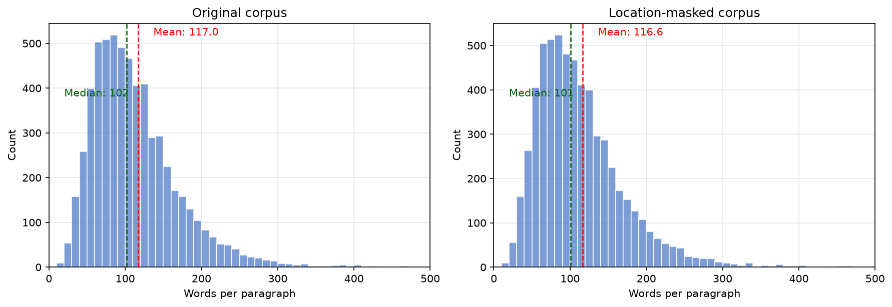
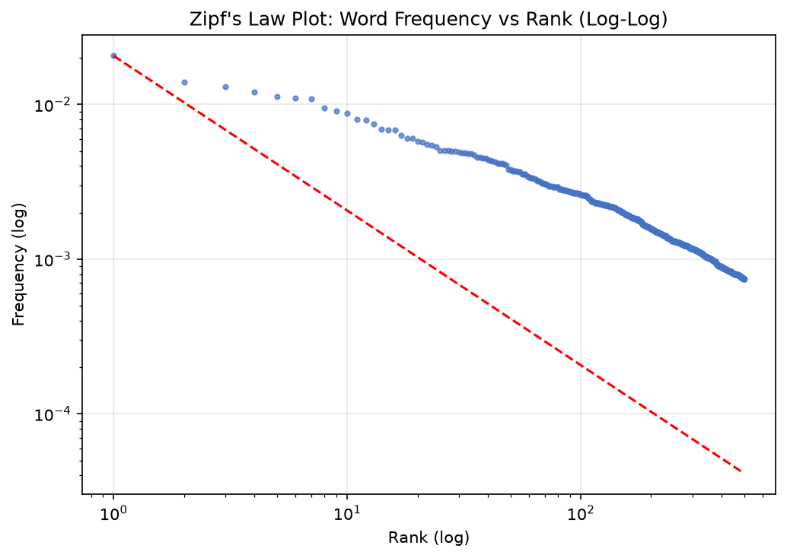
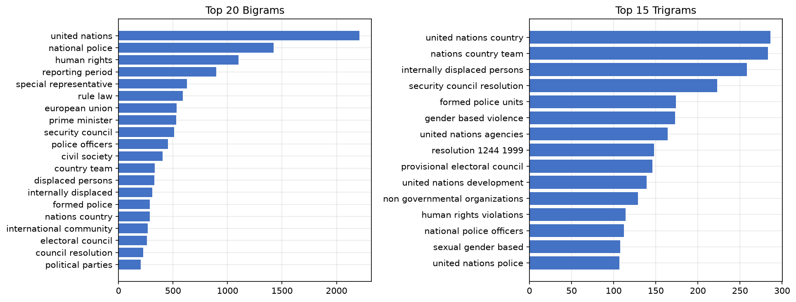
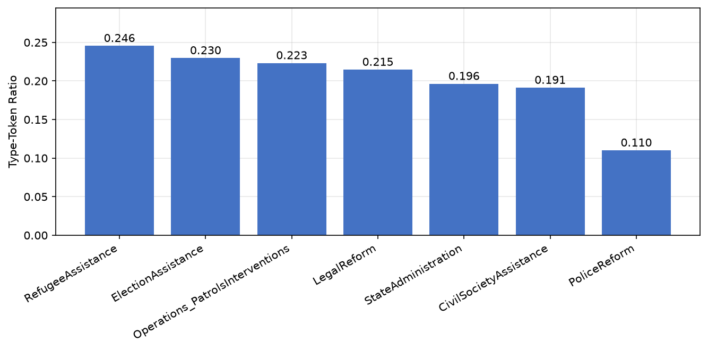
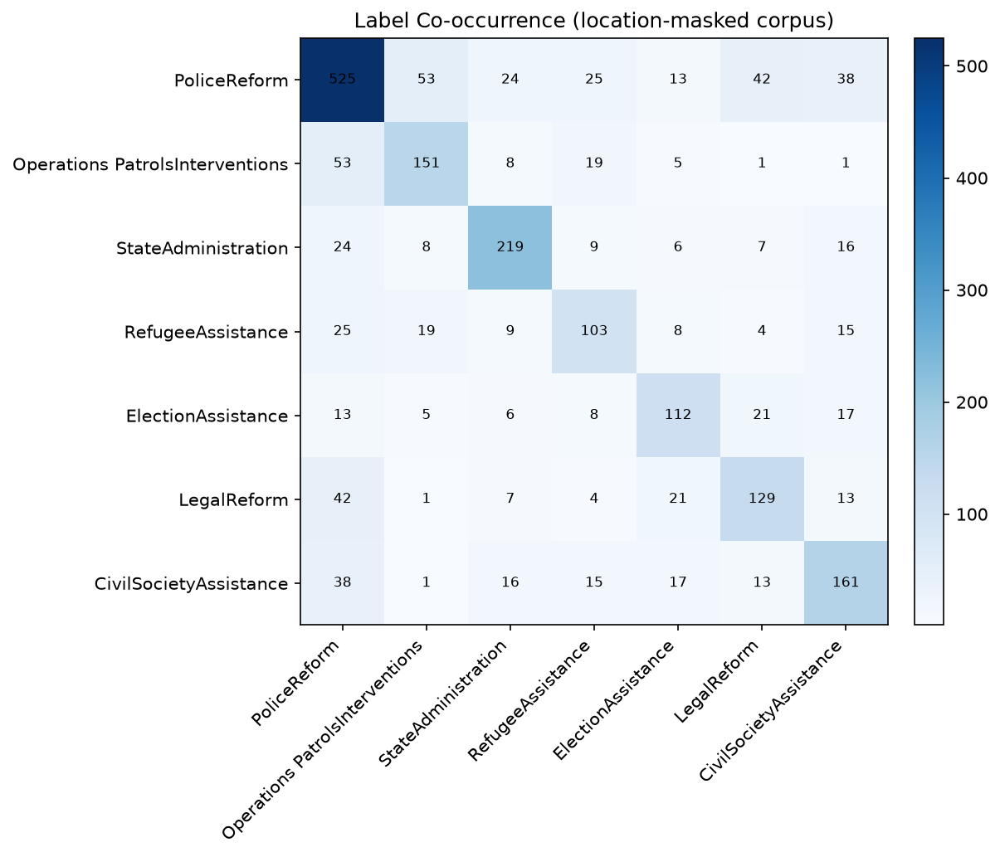
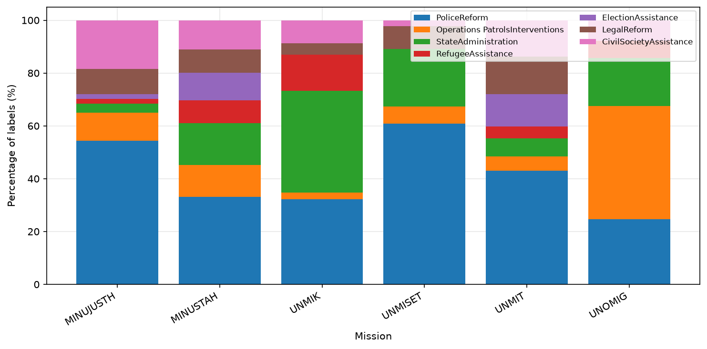
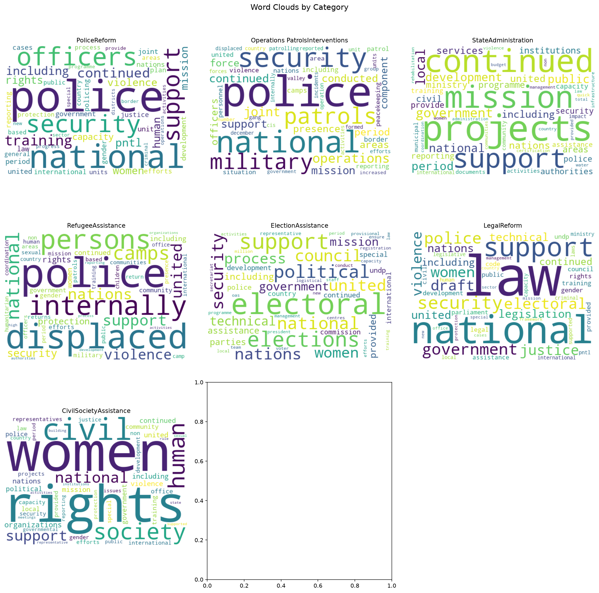
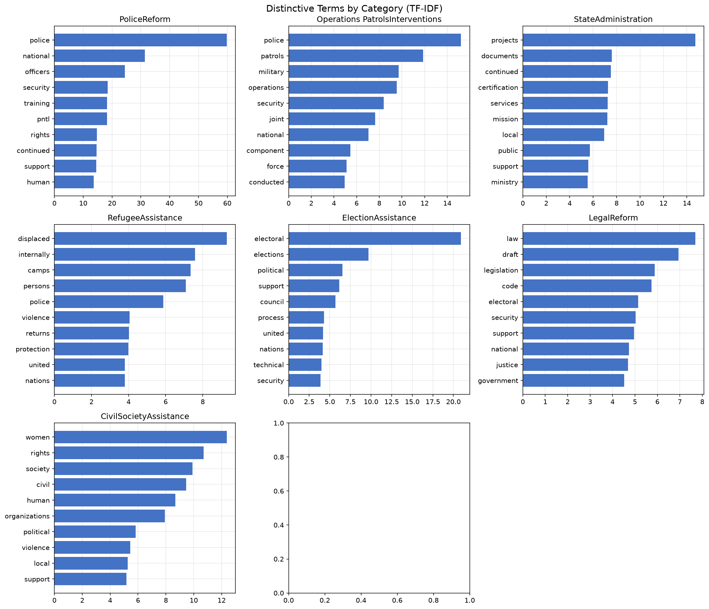

## Introduction {#sec-intro}

United Nations peacekeeping has expanded in ambition even as the political space for new missions has narrowed. Missions are now routinely asked to police, to reform institutions, to return refugees, and to support civil society—tasks that go far beyond the traditional interposition of forces. Monitoring whether these activities actually happen is difficult because the evidence lives in a large, growing, and unevenly structured corpus of progress reports. Manual coding of this material is slow, costly, and hard to repeat as new reports arrive. Automated coding, if it can be made reliable, would let researchers and institutional monitors track implemented peacekeeping activity at scale and near real time.

The empirical foundation for this effort is the Peacekeeping Activity Dataset (PACT). PACT 2.0 (@PACT2, @Otto2024) extends the original dataset beyond Africa to missions in Europe, the Americas, and Asia, and it codes, at the paragraph level, the activities that peacekeepers implement. A companion stream of work on peacekeeping mandates, such as PEMA (@Salvatore2022), captures what missions are *tasked* to do as written in Security Council resolutions; PACT instead captures what they *report doing* on the ground. Bridging the two—mandates as intent, PACT as implementation—is one of the clearest uses of a scalable coding pipeline.

This paper presents the full PACT-ML pipeline and evaluates its ability to code peacekeeping activity automatically. The pipeline parses reports, applies exploratory analysis, and fits both classical and transformer-based classifiers to the manually coded paragraphs. The central design problem is that the corpus is small, heavily imbalanced, and tightly coupled to location: because each mission operates in a single country, a model can appear to "code" activities by recognizing the mission rather than the activity it describes. We therefore introduce a location-deidentification step that masks geographic hints before any model is trained, and we validate with a mission-predictability probe that the shortcut is genuinely removed. We then compare a family of classical models—bag-of-words and TF-IDF representations of logistic regression, balanced logistic regression, and random forest—with a fine-tuned multilingual transformer, and we show that disciplined class-imbalance handling lets the transformer reach performance comparable to the best classical baseline.

The central finding is that automated coding is feasible, and that its bottleneck is not model expressiveness but annotated data volume and the separability of categories on surface vocabulary. The best model overall is balanced logistic regression on TF-IDF features (macro-F1 0.50). A fine-tuned XLM-RoBERTa model, when it is allowed to address class imbalance through class-weighted loss and per-label thresholds chosen under nested cross-validation, reaches macro-F1 0.48—slightly below, but competitive with, the best classical baseline—while a naively fine-tuned transformer collapses to macro-F1 below 0.20 by ignoring its rarest categories. Location masking removes the geographic shortcut, as measured by a probe that falls from 0.92 to 0.84 on full text and from 0.77 to chance on location tokens alone, at no measurable cost in task performance.

## Data {#sec-data}

PACT 2.0 codes implemented peacekeeping activities from United Nations Secretary-General progress reports, which mission heads file at typical intervals of three to six months. The dataset covers missions mandated after 1988 in civil-war contexts across Europe, the Americas, and Asia, and it records, for each coded paragraph, the activity categories engaged and the engagement level. Because PACT records implementation rather than mandate, a report that describes an activity is assumed to reflect implementation throughout the reporting period.

The raw reports were made available in English PDF form. Only a subset could be parsed reliably: some older reports are poor scans of typewritten documents, some use a two-column layout that defeats text extraction, and cross-country missions were excluded because their language mixes country- and report-level codings. Reports were pre-selected with PDF-layout clustering and parsed with a page-geometry-based pipeline; annex paragraphs were removed by enforcing a strictly increasing paragraph-numbering sequence, and reports were dropped if the extracted paragraph count diverged from the PACT data by more than ten percent. Paragraphs that contain no coded peacekeeping activity were excluded from the modeling corpus, and paragraphs with multiple codings were retained to reflect the multi-label structure of the task.

The modeling corpus used here is `data/merged_data.csv`, the frozen training set of 6,029 labeled paragraphs across six missions: MINUSTAH and MINUJUSTH (Haiti), UNMIK (Kosovo), UNMIT and UNMISET (Timor-Leste), and UNOMIG (Georgia). The corpus is dominated by the two Haitian missions (2,135 and 524 paragraphs), followed by UNMIK (1,963), UNMIT (855), UNOMIG (302), and UNMISET (250). Table {@tbl-class-distribution} reports the distribution of the seven target activity categories. The class imbalance is severe: PoliceReform accounts for 525 paragraphs (8.7%), while RefugeeAssistance (1.7%) and ElectionAssistance (1.9%) are rare. Any model that simply predicts the majority outcome for a rare class will appear accurate while contributing nothing—precisely the failure mode we confront in the methods and results.

| Category | Count | Share |
|---|---:|---:|
| PoliceReform | 525 | 8.7% |
| Operations_PatrolsInterventions | 151 | 2.5% |
| StateAdministration | 219 | 3.6% |
| RefugeeAssistance | 103 | 1.7% |
| ElectionAssistance | 112 | 1.9% |
| LegalReform | 129 | 2.1% |
| CivilSocietyAssistance | 161 | 2.7% |
| **Total** | **6029** | **100.0%** |

: Distribution of the seven target categories in the modeling corpus. {#tbl-class-distribution}

## Exploratory Data Analysis {#sec-eda}

We analyze the corpus before modeling, both to understand what makes categories separable and to expose the location confound that motivates deidentification. All statistics and figures in this section are computed on the location-deidentified corpus described in @sec-masking; the de-identification placeholder is excluded from the lexical statistics so that they reflect genuine vocabulary.

### Text Corpus Analysis

@fig-text-lengths shows that paragraphs included in the models did only differ slightly from all parsed paragraphs in length (mean 117 vs. 116.6 tokens; median 102 vs. 101), indicating that peacekeeping-relevant information is not strongly associated with paragraph length. This suggests that semantic content—rather than verbosity—drives relevance, and supports the feasibility of using NLP models that rely on textual meaning rather than surface-level features. Location masking changes paragraph length only marginally, because multi-word location phrases collapse into a single placeholder token.

{#fig-text-lengths}

Looking more specifically at the vocabulary, we identify 12,175 unique words (after removing stopwords) among 352,840 tokens, giving a type-token ratio of 0.035. The low type-token ratio indicates repetition, formulaic writing, or specialized language, which we expect for the normed UN reporting (@UN2019). The language of these reports is therefore highly standardized, which matters for modeling: categories must be separated by relatively few, frequently reused terms.

| Total words | Unique words | Type-token ratio |
|---:|---:|---:|
| 352840 | 12175 | 0.0345 |

: Vocabulary size and type-token ratio on the location-deidentified corpus (stopwords removed). {#tbl-voc}

To analyze the text corpus further, we look at Zipf's law of natural language. @Zipf1949 says:

::: {.blockquote}

If one ranks all the words occurring in a large corpus of natural language texts by their frequency of occurrence, the frequency of any word is inversely proportional to its rank.

:::

The Zipf's law plot of the corpus (@fig-zipf) shows a clear power-law distribution of word frequencies, confirming that the text follows the statistical patterns typical of natural language: a small number of words are extremely frequent, while the majority are rare. This stands in contrast to the relatively low type-token ratio, which suggests a repetitive, specialized language with limited lexical diversity. The apparent contradiction is explained by the domain: although the overall frequency distribution follows natural-language norms, the specific context of peacekeeping reports relies on a constrained vocabulary and frequent reuse of mission-specific terminology. This motivates the use of models that can capture both term frequency and contextual meaning.

{#fig-zipf}

#### N-Gram Analysis

@fig-ngrams displays the most frequent bigrams and trigrams in the corpus and offers insight into the dominant themes and institutional actors mentioned. The top trigrams—"united nations country", "nations country team", "internally displaced persons", "security council resolution", "formed police units"—and corresponding bigrams, such as "national police", "human rights", "reporting period", and "rule law", suggest a strong institutional framing. This language reflects frequent reference to national institutions (e.g., "national police"), and core thematic concerns of peacekeeping operations such as human rights, displacement, and police reform. After location masking, geographic anchors such as "port au prince" no longer appear among the most frequent n-grams, having been replaced by the placeholder; the institutional and thematic vocabulary is unchanged.

{#fig-ngrams}

The concentration of institutional terminology matters for the classical models: categories like PoliceReform are well identified because the names of national authorities recur, while the presence of geographic anchors would otherwise bias results. The importance of these features in combination with differentiated activity implementation across missions can lead a model to learn that an activity was carried out because of the location, not because of activity-specific language. This is the confound we remove in @sec-masking.

### Category-Specific Analysis

The differences in type-token ratio (TTR) across categories (@fig-ttr) have important implications for the modeling approaches. High-TTR categories like RefugeeAssistance draw on a richer vocabulary and may yield sparser feature representations for bag-of-words models when training data are scarce. Conversely, low-TTR categories like PoliceReform produce denser, more repetitive word distributions, potentially making them easier to model with frequency-based approaches but also more susceptible to overfitting on frequent terms. For transformer models, which capture contextual semantics, high lexical diversity can enhance learning if the model is exposed to varied contexts, but it may also challenge generalization if vocabulary usage is highly domain-specific.

{#fig-ttr}

The co-occurrence matrix in @fig-co-occurrence shows how frequently pairs of activity categories are coded together within the same paragraph. The co-occurrence of the textually related categories PoliceReform and Operations_PatrolsInterventions is relatively modest, which is to our advantage: it means the models can treat them as more separable than if they shared a large share of police and military language. The label distribution by mission (@fig-label-mission) shows that missions differ substantially in which activities they emphasize—UNMIK in Kosovo, for example, carries the highest share of CivilSocietyAssistance codings, while UNOMIG in Georgia has a relatively high share of Operations. These mission-level differences are precisely what makes location a leakage channel: if a category is overrepresented in a single mission, its location tokens become predictive of the category.

{#fig-co-occurrence}

{#fig-label-mission}

@fig-category-analysis-1 shows word clouds for the complete text data by category. Some words are heavily replicated across categories: "police" appears as a central term in several categories, reflecting the semantic structure of the term as an important distinction for extracting the correct labels. @fig-category-analysis-2 shows the distinctive terms by their TF-IDF score, which reflects the importance of each term within a given category relative to its distribution across the entire corpus. TF-IDF, or Term Frequency–Inverse Document Frequency, is computed as

$$
\text{TF-IDF}(t, d, D) = \text{TF}(t, d) \times \text{IDF}(t, D) = \frac{f_{t,d}}{\sum_{t' \in d} f_{t',d}} \times \log\left(\frac{N}{1 + \left| \{ d' \in D : t \in d' \} \right|}\right)
$$

This version uses log-scaled inverse document frequency with term frequency normalized by document length, the common scikit-learn implementation. The distinctive terms are category-specific and informative: "patrols" and "military" for Operations, "displaced" and "internally" for RefugeeAssistance, "electoral" and "elections" for ElectionAssistance, "draft" and "legislation" for LegalReform, and "women" and "rights" for CivilSocietyAssistance. Notably, after deidentification no category is led by a geographic token (e.g., "kosovo" or "georgian"), which previously appeared because of the imbalance of label distributions within and across missions. The distinctive terms are guaranteed to be different across categories in a multi-label setup, but missing key terminology like "police" may still lead to a higher misclassification rate, especially regarding false positives.

{#fig-category-analysis-1}

{#fig-category-analysis-2}

## Location Deidentification {#sec-masking}

A mission's identity is a strong leakage channel. Because different missions emphasize different activity categories (see @fig-label-mission), a model could learn to predict a category by recognizing the location rather than by recognizing the activity. The mission acronym, the host country, its cities, and its demonyms appear throughout the text, so this shortcut is both strong and easy to exploit. We therefore deidentify the modeling corpus with respect to location, applied identically at training and evaluation time.

We implement this as a reproducible preprocessing step (`modules/07_location_masking.py`) that produces a derived corpus, `out/derived/merged_data_masked.csv`, in which location hints are replaced by a `[LOC]` token. The frozen `data/` CSVs are never modified. Masking combines three deterministic mechanisms:

1. **Named-entity recognition.** A fine-tuned BERT NER model (`dslim/bert-base-NER`) tags GPE (geo-political entity) and LOC (location) mentions, which are replaced.
2. **Mission-acronym masking.** The six mission acronyms (MINUSTAH, UNMIK, UNMIT, MINUJUSTH, UNOMIG, UNMISET) are masked as location hints, because they are unambiguous country indicators.
3. **A geonym/demonym gazetteer.** Countries, cities, regions, and demonyms associated with the six host countries (e.g. Haiti/Haitian, Kosovo/Kosovar, Dili, Abkhazia, East Timor/Timorese) are masked, because NER frequently misses adjectival demonyms.

The transformation replaced 23,840 location spans across 5,328 of 6,029 paragraphs. Because the transformation is a corpus-level rewrite applied before any train/validation/test split, the same masked text is seen at training and evaluation time, so no information asymmetry is introduced.

To validate that the location shortcut is actually gone, we run two probes. A **mission-predictability probe** fits a TF-IDF + logistic-regression classifier to predict the mission from a paragraph's text, measured with five-fold cross-validation on both the original and the masked corpus. A **location-only probe** predicts the mission from location tokens alone (mission acronyms and geonyms/demonyms). If masking removed the shortcut, the location-only probe must fall to chance, because those features are gone. The results are reported in @sec-results.

## Methods {#sec-meth}

### Task and evaluation

The task is multi-label text classification over seven activity categories: a paragraph may be assigned to several categories, and each is predicted independently. Following standard practice for multi-label data, we use `IterativeStratification` from `scikit-multilearn` for five-fold splits, which preserves label distributions across folds and is deterministic. We report the standard multi-label metrics: micro-F1 (global counts) and macro-F1 (per-label F1 averaged, so every category counts equally), together with per-label precision, recall, and F1, and the full confusion-matrix statistics per label. Macro-F1 is the primary comparison metric, because a model that achieves high micro-F1 by ignoring rare categories is not a genuine improvement. In multi-label settings this stability assessment matters especially because IterativeStratification, despite its sophisticated label-balancing, cannot always achieve perfect stratification given the complexity of label co-occurrence patterns; we therefore also report the variance of macro-F1 across folds.

### Classical baselines

We build a family of classical baselines over two text representations. For bag-of-words, a `CountVectorizer` (stop words removed, `min_df=5`, `max_df=0.95`) encodes raw term frequencies; for TF-IDF, a `TfidfVectorizer` with the same parameters scales frequencies by inverse document frequency, down-weighting terms common across the corpus and up-weighting those unique to specific documents. As discussed in @sec-eda, many high-frequency institutional terms (e.g. "government", "operation") would otherwise dominate a count-based feature space without contributing to differentiation.

On each representation we fit three classifiers, wrapped for multi-label via `OneVsRestClassifier`:

- **Logistic Regression** (`liblinear`, lasso penalty; bag-of-words C=1.0, TF-IDF C=10.0, `max_iter=1000`);
- **Balanced Logistic Regression** (same, with `class_weight='balanced'`; bag-of-words C=0.1/lasso, TF-IDF C=1.0/ridge);
- **Random Forest** (75 trees, `max_depth=None`, `min_samples_split=2`).

In classification tasks with imbalanced class distributions, standard models become biased toward the majority class. We address this with class weighting, which assigns higher weights to underrepresented classes in the loss, mitigating the imbalance. Balanced class weighting encourages the model to learn a more equitable decision boundary, improving recall and F1 for all classes—particularly important in multi-label classification, where each label exhibits different frequency. For a binary base classifier with $n$ samples and $n_i$ positive samples in class $i$, the weight is

$$
w_i = \frac{n_{\text{samples}}}{n_{\text{classes}} \times n_i}
$$ {#eq-balanced-weight}

### BERT-class model {#sec-bert}

Bidirectional Encoder Representations from Transformers (BERT) replaces surface-level feature engineering with deep contextual language understanding. Unlike CountVectorizer and TF-IDF, which generate fixed, sparse representations based on term-level statistics, BERT constructs dense, context-sensitive embeddings for each token derived from its position and surrounding context. This allows BERT to model word sense disambiguation and syntactic and semantic relationships invisible to bag-of-words representations. Its context-aware modeling can capture nuanced meaning and improve downstream classification, while eliminating the need for stopword removal, stemming, or lemmatization.

Because training a BERT model from scratch is computationally expensive, we fine-tune a pre-trained model. We use the XLM-RoBERTa base model (`xlm-roberta-base`), trained by Facebook AI on a multitude of languages. Its cross-lingual capabilities allow the model to use the translated reports (up to the six official UN languages) as a validity check for future classification, which the monolingual RoBERTa model does not. It is trained on up to 295GB of text, more than the ~100GB of RoBERTa base and ~16GB of the original BERT, and on more report-style "real-world" data; the disadvantage is a higher computational effort.

We fine-tune `xlm-roberta-base` for multi-label classification with the `transformers` `Trainer` (4 epochs, batch size 16, sequence length 256, learning rate 2e-5, weight decay 0.01). The naively fine-tuned model uses a fixed decision threshold of 0.5 and an unweighted binary cross-entropy loss. As we show in @sec-results, this model collapses: because minority categories contribute so few positive examples, an unweighted loss lets them vanish, and a single 0.5 threshold predicts "absent" for them.

We therefore introduce two improvements, both chosen under nested cross-validation so that no hyperparameter is tuned on the held-out test split:

- **Class-weighted loss.** We weight each category's loss by `pos_weight = n_neg / n_pos` (capped at 15), computed from the training split, so rare categories are penalized proportionally more for misses.
- **Per-label decision thresholds.** Instead of a single fixed 0.5 threshold, we choose a probability threshold per category that maximizes that category's F1 on a validation split.

Nested discipline: within each of the five outer folds, the fold's training portion is split again by `IterativeStratification` into inner-train and inner-validation. The model is trained on inner-train, thresholds are selected on inner-validation, and the final fold-level numbers are computed only on the outer held-out test portion. Thresholds are therefore never tuned on test data. All random seeds that can be fixed are fixed (torch and numpy seed 0); `IterativeStratification` is itself deterministic.

### Cross-validation strategy

To ensure robust evaluation we employ Stratified K-Fold Cross-Validation via `IterativeStratification`, which splits the data into five folds while preserving label distributions, critical given the imbalanced and multi-label nature of the dataset. Unlike standard K-Fold, stratification prevents biased performance estimates when rare labels are unevenly distributed. `IterativeStratification` does not support a random state parameter because it uses a deterministic algorithm to balance label distributions in each fold; since the same cross-validation was used across all models, results remain comparable. All models—classical and transformer—are trained and evaluated on the same deidentified corpus and the same five-fold splits, so the ranking in @sec-results is directly comparable.

## Results {#sec-results}

### Model ranking

We report both micro-F1 and macro-F1, precision and recall, averaged across the five folds, together with the fold-level macro-F1 to convey stability. The ranking in @tbl-model-ranking aggregates all models on the location-deidentified corpus.



@tbl-model-ranking aggregates the run artifacts. Balanced logistic regression on TF-IDF features is the strongest overall model (macro-F1 0.50), consistent with the view that the categories are largely separable on surface vocabulary and that class-imbalance handling matters. The naively fine-tuned BERT model sits at the bottom, reproducing the class-collapse we describe above. The improved BERT model, trained with class-weighted loss and per-label thresholds on the deidentified corpus, rises to the upper part of the table (macro-F1 0.48), competitive with—though slightly below—the best classical baseline. Notably, the two strongest categories in the fine-tuned model, and the categories on which the classical models also perform best, are the larger classes PoliceReform and Operations_PatrolsInterventions, supporting the view that limited training data, rather than model expressiveness, is the binding constraint.

The fold-level macro-F1 values reported in @tbl-model-ranking convey the stability of each model. The classical linear models are stable across folds, while the naively fine-tuned transformer is highly unstable, a symptom of its minority-class collapse. The improved transformer is both stronger and more stable.

{#fig-fold-variance}

### The BERT model: from collapse to recovery

@tbl-bert-per-label reports per-label precision, recall, and F1 for the naively fine-tuned BERT model and the improved BERT model, both on the deidentified corpus.



@tbl-bert-per-label shows the two effects that drive the improvement. First, class-weighted loss gives minority categories a non-zero chance of being predicted, so their recall no longer collapses to zero. Second, per-label thresholds convert those probabilities into recoveries of recall: where the naively fine-tuned model returns 0.0 F1 for RefugeeAssistance, ElectionAssistance, LegalReform, and StateAdministration, the improved model reaches non-trivial F1 on every one of these previously-zero categories. The two strongest classes, PoliceReform and Operations_PatrolsInterventions, are not degraded. @fig-per-label visualizes the same comparison.

{#fig-per-label}

### Location masking and the shortcut

The masking validation is reported in @tbl-masking-probe. The full-text mission-predictability probe drops from 0.917 on the original corpus to 0.844 on the masked corpus; the residual signal is thematic content—missions that focus on different activities use different vocabulary—which is legitimate signal rather than a location shortcut. The location-only probe is the decisive check: on the original corpus, location tokens alone predict the mission with 0.770 accuracy; after masking, the location tokens are gone and the probe collapses to 0.000 (chance is 0.167). The geographic shortcut is therefore removed.



On the final model, masking does not degrade performance: the improved model trained on the masked corpus reaches macro-F1 0.475, essentially identical to the 0.479 it reaches on the original corpus. This is the combination we want—the shortcut removed with no cost in task performance. The deidentified corpus is therefore the appropriate training set for any deployment of the pipeline, because it removes a mission-specific shortcut that would otherwise inflate apparent accuracy and harm generalization to new missions.

## Discussion {#sec-disc}

The results yield three findings. First, the fine-tuned transformer's naive failure is real and reproducible: with an unweighted loss and a fixed threshold, five of the seven categories collapse to zero recall. Second, a modest, disciplined intervention—class weighting plus per-label thresholds, both chosen without touching the test split—recovers those categories and lifts macro-F1 from below 0.20 to 0.48, without harming the two strong classes. Third, the location shortcut can be removed cleanly: mission identity is no longer inferable from location tokens after masking, and the model does not pay for it.

These results should be read with their limits in mind. The best model overall remains balanced logistic regression on TF-IDF features, which is strong evidence that the dominant signal in this corpus is surface vocabulary and category-specific terminology rather than context-dependent semantics. The corpus is small—six missions, 6,029 paragraphs, rare minority categories—so fine-tuning a large multilingual transformer is unlikely to realize its potential, and a transformer's advantage may emerge only with a substantially larger annotated corpus or a multi-lingual evaluation setting. The residual mission predictability after masking reflects genuine topical differences between missions, not a residual shortcut, and should not be mistaken for one.

Several design decisions warrant comment. Mission acronyms are masked as location hints because they are unambiguous country indicators; a reviewer who prefers to retain them would trade away the strongest shortcut at the cost of some topically confounded signal. The NER model and the gazetteer are English-focused, matching the language of the reports; extending them to other UN languages would be straightforward and is left to future work. The class-weight cap and the threshold grid are pragmatic choices reported in the Annex. Finally, the deidentified corpus is a derived artifact: because deidentification is a corpus-level transformation, the same masked text is used for training and evaluation, so no information asymmetry is introduced, and the frozen raw data remain untouched and available for external validation.

## Conclusion {#sec-conc}

Automated coding of peacekeeping activity is feasible but bounded by data and by the nature of the task. This paper presents a complete, reproducible pipeline for coding United Nations peacekeeping activities from Secretary-General progress reports, combining exploratory analysis, location deidentification, and a family of classical and transformer-based classifiers. We show that the categories are largely separable on surface vocabulary—balanced logistic regression on TF-IDF features achieves macro-F1 0.50—and that a fine-tuned multilingual transformer, when its class imbalance is addressed through weighted loss and per-label thresholds chosen under nested cross-validation, reaches competitive performance (macro-F1 0.48) and recovers non-trivial F1 on minority categories that a naively fine-tuned model leaves at zero. We further show that a mission-specific geographic shortcut can be removed at no measurable cost: location masking drives a location-only mission-predictability probe from 0.77 to chance while leaving model performance essentially unchanged. The deidentified corpus, and the pipeline that produces it, provide a foundation for scaling the coding of peacekeeping activity to new reports and new missions, and for linking implemented activity (PACT) to mandated activity (PEMA) at scale.

## Annex {#sec-annex}

### Class distribution in the full PACT 2.0 data

The full PACT 2.0 data set codes more categories than the seven used for this feasibility test. The distribution below is from the full dataset.

| Category | Count | Share |
|---|---:|---:|
| PoliceReform | 1232 | 25.3% |
| Operations_PatrolsInterventions | 587 | 12.1% |
| StateAdministration | 581 | 11.9% |
| HumanRights | 450 | 9.3% |
| JusticeSectorReform | 435 | 8.9% |
| Demilitarization | 350 | 7.2% |
| RefugeeAssistance | 312 | 6.4% |
| ElectionAssistance | 265 | 5.5% |
| BorderControl | 251 | 5.2% |
| MilitaryReform | 247 | 5.1% |
| LegalReform | 235 | 4.8% |
| CivilSocietyAssistance | 232 | 4.8% |
| PrisonReform | 228 | 4.7% |
| HumanitarianRelief | 222 | 4.6% |
| Gender | 209 | 4.3% |
| PartyAssistance | 178 | 3.7% |
| DemocraticInstitutions | 144 | 3.0% |
| SexualViolence | 142 | 2.9% |
| ControlSALW | 133 | 2.7% |
| Operations_UseOfForce | 132 | 2.7% |
| TransitionalJustice | 123 | 2.5% |
| PublicHealth | 109 | 2.2% |
| LocalReconciliation | 102 | 2.1% |
| ElectoralSecurity | 99 | 2.0% |
| EconomicDevelopment | 98 | 2.0% |

### Model parameters

- **Bag-of-Words / TF-IDF models**: Logistic Regression and Balanced Logistic Regression (liblinear solver; bag-of-words LR C=1.0/lasso, Balanced LR C=0.1/lasso; TF-IDF LR C=10.0/lasso, Balanced LR C=1.0/ridge; `max_iter=1000`); Random Forest (75 trees, `max_depth=None`, `min_samples_split=2`). Vectorizers: `CountVectorizer`/`TfidfVectorizer`, `stop_words='english'`, `min_df=5`, `max_df=0.95`.
- **BERT baseline**: `xlm-roberta-base`, multi-label, 5-fold `IterativeStratification`, 4 epochs, batch 16, sequence length 256, learning rate 2e-5, weight decay 0.01, threshold 0.5.
- **BERT improved**: same architecture; per-category `pos_weight = n_neg / n_pos` capped at 15; per-label thresholds selected on an inner validation split over the grid 0.05–0.90 in steps of 0.05; nested 80/20 inner split per outer fold.
- **Seeds**: torch and numpy fixed to 0 for all BERT runs; classical models seeded to 161 (matching the notebook pipeline).

### Reproducibility

- Environment: `requirements.txt` (exact versions) and `environment.yml`.
- Masking: `modules/07_location_masking.py` → `out/derived/merged_data_masked.csv`.
- Exploratory analysis: `modules/08_eda.py` → `report/figures/eda/`.
- Classical baselines: `modules/04_05_baselines.py --source bow|tfidf --data <corpus> --out <csv>`.
- Model stage: `modules/06_roberta_model.py --mode baseline|improved [--data ...] [--out ...]`.
- Runner: `modal/run_pact_ml.py` (L4 GPU, pinned image; artifacts on a persistent Modal volume).
- Report tables and figures: `report/make_artifacts.py`.
