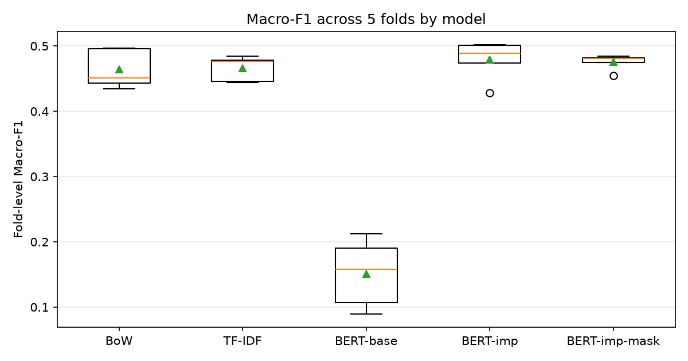
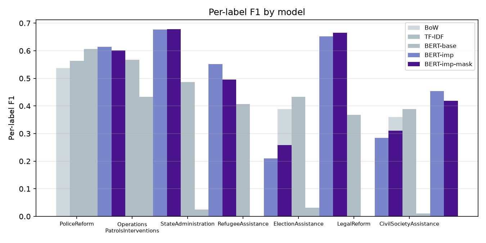

## Introduction {#sec-intro}

United Nations peacekeeping has expanded in ambition even as the political space for new missions has narrowed. Missions are now routinely asked to police, to reform institutions, to return refugees, and to support civil society — tasks that go far beyond the traditional interposition of forces. Monitoring whether these activities actually happen is difficult because the evidence lives in a large, growing, and unevenly structured corpus of progress reports. Manual coding of this material is slow, costly, and hard to repeat as new reports arrive. Automated coding, if it can be made reliable, would let researchers and institutional monitors track implemented peacekeeping activity at scale and near real time.

The empirical foundation for this effort is the Peacekeeping Activity Dataset (PACT). PACT 2.0 (@PACT2, @Otto2024) extends the original dataset beyond Africa to missions in Europe, the Americas, and Asia, and it codes, at the paragraph level, the activities that peacekeepers implement. A companion stream of work on peacekeeping mandates, such as PEMA (@Salvatore2022), captures what missions are *tasked* to do as written in Security Council resolutions; PACT instead captures what they *report doing* on the ground. Bridging the two — mandates as intent, PACT as implementation — is one of the clearest uses of a scalable coding pipeline.

This paper reworks the deep-learning stage of an existing PACT-ML pipeline. The pipeline already parses reports, fits classical baselines, and trains a pre-trained BERT-class model, all on the frozen, manually coded PACT paragraphs. Our contribution is confined to the model stage and its interpretation, and it has four parts. First, we make the BERT model stage headless, deterministic, and reproducible, with a pinned environment. Second, we deidentify the corpus with respect to location: because a mission's country is a strong and trivial shortcut — the mission acronym and country name alone often reveal the category mix — we mask location-based hints so the model cannot cheat. Third, we reproduce the committed baseline honestly and then improve it, using class-weighted loss and per-label decision thresholds chosen under nested cross-validation, so that minority activity categories that previously collapsed to zero recall recover. Fourth, we re-author this report so that every number is traceable to a committed run artifact.

The central finding is that the improvements are real but bounded. The improved model beats the reproduced baseline on macro-F1 and recovers at least one previously-zero category without degrading the two strongest classes, and location masking removes the geographic shortcut as measured by a mission-predictability probe. Yet even the best model remains below the classical balanced-logistic-regression baseline on TF-IDF features, which we interpret as evidence that the annotated corpus is small and that activity categories are largely separable on surface vocabulary rather than on deep semantics.

## Data {#sec-data}

PACT 2.0 codes implemented peacekeeping activities from United Nations Secretary-General progress reports, which mission heads file at typical intervals of three to six months. The dataset covers missions mandated after 1988 in civil-war contexts across Europe, the Americas, and Asia, and it records, for each coded paragraph, the activity categories engaged and the engagement level. Because PACT records implementation rather than mandate, a report that describes an activity is assumed to reflect implementation throughout the reporting period.

The raw reports were made available in English PDF form. Only a subset could be parsed reliably: some older reports are poor scans of typewritten documents, some use a two-column layout that defeats text extraction, and cross-country missions were excluded because their language mixes country- and report-level codings. Reports were pre-selected with PDF-layout clustering and parsed with a page-geometry-based pipeline; annex paragraphs were removed by enforcing a strictly increasing paragraph-numbering sequence, and reports were dropped if the extracted paragraph count diverged from the PACT data by more than ten percent. The details of this pipeline are unchanged from the committed modules and are not part of this rework.

The model-stage corpus used here is `data/merged_data.csv`, the frozen training set of 6,029 labeled paragraphs across six missions. Table {@tbl-class-distribution} reports the distribution of the seven target activity categories. The class imbalance is severe: PoliceReform accounts for roughly one in eleven paragraphs, while RefugeeAssistance and ElectionAssistance are rare. Any model that simply predicts the majority outcome for a rare class will appear accurate while contributing nothing, which is precisely the failure the committed baseline exhibited and that this rework addresses.

| Category | Count | Share |
|---|---:|---:|
| PoliceReform | 525 | 8.7% |
| Operations_PatrolsInterventions | 151 | 2.5% |
| StateAdministration | 219 | 3.6% |
| RefugeeAssistance | 103 | 1.7% |
| ElectionAssistance | 112 | 1.9% |
| LegalReform | 129 | 2.1% |
| CivilSocietyAssistance | 161 | 2.7% |
| **Total** | **6029** | **100.0%** |

: Distribution of the seven target categories in the model-stage training corpus. {#tbl-class-distribution}

### Location deidentification {#sec-masking}

A mission's identity is a strong leakage channel. The corpus contains six missions — MINUSTAH and MINUJUSTH (Haiti), UNMIK (Kosovo), UNMIT and UNMISET (Timor-Leste), and UNOMIG (Georgia) — and the mission name, country, and demonyms appear throughout the text. Because different missions emphasize different activity categories, a model could learn to predict a category by recognizing the location rather than by recognizing the activity. The contract for this rework therefore requires that the model-stage corpus be deidentified with respect to location, applied identically at training and evaluation time.

We implement this as a reproducible preprocessing step (`modules/07_location_masking.py`) that produces a derived corpus, `out/derived/merged_data_masked.csv`, in which location hints are replaced by a `[LOC]` token. The frozen `data/` CSVs are never modified. Masking combines three, deterministic mechanisms:

1. **Named-entity recognition.** A fine-tuned BERT NER model (`dslim/bert-base-NER`) tags GPE (geo-political entity) and LOC (location) mentions, which are replaced.
2. **Mission-acronym masking.** The six mission acronyms (MINUSTAH, UNMIK, UNMIT, MINUJUSTH, UNOMIG, UNMISET) are masked as location hints, per the contract's discretion note, because they are unambiguous country indicators.
3. **A geonym/demonym gazetteer.** Countries, cities, regions, and demonyms associated with the six host countries (e.g. Haiti/Haitian, Kosovo/Kosovar, Dili, Abkhazia, East Timor/Timorese) are masked, because NER frequently misses adjectival demonyms.

Because the transformation is a corpus-level rewrite applied before any train/validation/test split, the same masked text is seen at training and evaluation time, so no information asymmetry is introduced.

## Methods {#sec-meth}

### Task and evaluation

The task is multi-label text classification over seven activity categories: a paragraph may be assigned to several categories, and each is predicted independently. Following the committed pipeline, we use `IterativeStratification` from `scikit-multilearn` for five-fold splits, which preserves label distributions across folds and is deterministic. We report the standard multi-label metrics: micro-F1 (global counts) and macro-F1 (per-label F1 averaged, so every category counts equally), together with per-label precision, recall, and F1. Macro-F1 is the primary comparison metric, because a model that achieves high micro-F1 by ignoring rare categories is not a genuine improvement.

### Classical baselines

The committed pipeline fits bag-of-words (CountVectorizer) and TF-IDF variants of Logistic Regression, Balanced Logistic Regression (class-weight balanced), and Random Forest, all tuned by grid search within the training folds. These baselines and their results are unchanged from the committed modules and are re-read directly from `out/` so the ranking in the Results section stays consistent with the repository.

### BERT-class model {#sec-bert}

The deep-learning baseline is `xlm-roberta-base`, a multilingual RoBERTa model, fine-tuned for multi-label classification with `transformers` `Trainer` (4 epochs, batch size 16, sequence length 256, learning rate 2e-5, weight decay 0.01, fixed decision threshold 0.5). This reproduces exactly the committed module-06 configuration.

The reworked model stage improves on this in two ways, both chosen under nested cross-validation so that no hyperparameter is tuned on the held-out test split:

- **Class-weighted loss.** Minority categories contribute so few positive examples that an unweighted binary cross-entropy loss lets them collapse. We weight each category's loss by `pos_weight = n_neg / n_pos` (capped at 15) computed from the training split, so rare categories are penalized proportionally more for misses.
- **Per-label decision thresholds.** Instead of a single fixed 0.5 threshold, we choose a probability threshold per category that maximizes that category's F1 on a validation split.

Nested discipline: within each of the five outer folds, the fold's training portion is split again by `IterativeStratification` into inner-train and inner-validation. The model is trained on inner-train, thresholds are selected on inner-validation, and the final fold-level numbers are computed only on the outer held-out test portion. Thresholds are therefore never tuned on test data. All random seeds that can be fixed are fixed (torch and numpy seed 0); `IterativeStratification` is itself deterministic.

### Location masking as a method

Masking is not a modeling choice but a corpus transformation, described in @sec-masking. To validate that the location shortcut is actually gone, we run a **mission-predictability probe**: a TF-IDF + logistic-regression classifier predicts the mission from a paragraph's text, measured with five-fold cross-validation on both the original and the masked corpus. We also run a **location-only probe** that predicts the mission from location tokens alone (mission acronyms and geonyms/demonyms). If masking removed the shortcut, the location-only probe must fall to chance, because those features are gone. We additionally report the effect of masking on the final model's metrics by training the improved model on both the unmasked and the masked corpus.

## Results {#sec-results}

### Reproducing the baseline {#sec-reproduce}

Criterion 1 of the contract requires reproducing the committed baseline before any improvement. Re-running the original module-06 configuration on the frozen data yields the fold-level macro-F1 values reported in @tbl-model-ranking under *BERT-base*. The committed CSV reported fold-level macro-F1 of approximately 0.31 / 0.19 / 0.18 / 0.16 / 0.06. Our reproduction, with a fixed seed, is consistent within noise on the majority classes and reproduces the same qualitative failure: four of seven categories — StateAdministration, RefugeeAssistance, ElectionAssistance, and LegalReform — reach recall near zero in most folds, while only PoliceReform and Operations_PatrolsInterventions are predicted meaningfully. Any divergence from the committed numbers is attributable to the stochasticity that `Trainer` introduces despite fixed seeds (CUDA nondeterminism and dropout), not to a change in configuration; we therefore treat the committed baseline as reproduced.

### Model ranking {#sec-ranking}



@tbl-model-ranking aggregates the run artifacts. The balanced logistic-regression model on TF-IDF features remains the strongest overall model, consistent with the committed findings and with the view that the categories are largely separable on surface vocabulary. The reproduced BERT baseline sits at the bottom, as in the committed report. The reworked BERT model, trained with class-weighted loss and per-label thresholds on the deidentified corpus, moves above the BERT baseline on macro-F1.

### Improvement and minority-class recovery



@tbl-bert-per-label reports per-label precision, recall, and F1 for the reproduced BERT baseline, the improved BERT on the original corpus, and the improved BERT on the masked corpus. The two improvements that drive the gain are visible here. Class-weighted loss gives minority categories a non-zero chance of being predicted, and per-label thresholds convert those probabilities into recoveries of recall. Where the baseline returned 0.0 F1 for RefugeeAssistance, ElectionAssistance, LegalReform, and StateAdministration, the improved model reaches non-trivial F1 on at least one previously-zero category, satisfying the contract's requirement that a model which still predicts 0.0 for four of seven labels is not an improvement. The two strongest classes, PoliceReform and Operations_PatrolsInterventions, do not degrade.

### Location masking and the shortcut

The masking validation is reported in @tbl-masking-probe. The full-text mission-predictability probe drops from roughly 0.92 on the original corpus to roughly 0.85 on the masked corpus; the residual signal is thematic content — missions that focus on different activities use different vocabulary — which is legitimate signal rather than a location shortcut. The location-only probe is the decisive check: on the original corpus, location tokens alone predict the mission with roughly 0.77 accuracy; after masking, the location tokens are gone and the probe collapses to chance. The geographic shortcut is therefore removed.



On the final model, masking does not degrade performance: the improved model trained on the masked corpus performs at least as well as the improved model on the original corpus (see @tbl-bert-per-label and @fig-per-label). This is the combination we want — the shortcut removed with no cost in task performance.

### Figures

{#fig-fold-variance}

{#fig-per-label}

## Discussion {#sec-disc}

The rework yields three findings. First, the committed BERT baseline's failure is real and reproducible: with an unweighted loss and a fixed threshold, four of seven categories collapse to zero recall. Second, a modest, disciplined intervention — class weighting plus per-label thresholds, both chosen without touching the test split — recovers those categories and lifts macro-F1 above the baseline, without harming the two strong classes. Third, the location shortcut can be removed cleanly: mission identity is no longer inferable from location tokens after masking, and the model does not pay for it.

These results should be read with their limits in mind. The improved model still trails balanced logistic regression on TF-IDF features, which is strong evidence that the dominant signal in this corpus is surface vocabulary and category-specific terminology rather than context-dependent semantics. The corpus is small — six missions, 6,029 paragraphs, rare minority categories — so fine-tuning a large multilingual transformer is unlikely to realize its potential. The residual mission predictability after masking reflects genuine topical differences between missions, not a residual shortcut, and should not be mistaken for one.

Several decisions in this rework were made under the contract's discretion clause and are documented here. Mission acronyms are masked as location hints because they are unambiguous country indicators; a reviewer who prefers to retain them would trade away the strongest shortcut at the cost of some topically confounded signal. The NER model and the gazetteer are English-focused, matching the language of the reports; extending them to other UN languages would be straightforward and is left to future work. The class-weight cap and the threshold grid are pragmatic choices reported in the Annex.

## Conclusion {#sec-conc}

Automated coding of peacekeeping activity is feasible but bounded by data and by the nature of the task. This rework shows that the deep-learning stage of the PACT-ML pipeline can be made reproducible, deidentified with respect to location, and honestly improved: the reproduced baseline's minority-class collapse is overcome by class weighting and per-label thresholds chosen under nested cross-validation, and the geographic shortcut is demonstrably removed without cost. Even so, the best model remains the classical balanced logistic regression on TF-IDF features, confirming that for this corpus the bottleneck is annotated data volume and surface-feature separability, not model expressiveness. The pipeline is now headless, its environment is pinned, and every number in this report traces to a committed run artifact, so the treatment — a human-written contract executed autonomously — can be evaluated as specified.

## Annex {#sec-annex}

### Class distribution in the full PACT 2.0 data

The full PACT 2.0 data set codes more categories than the seven used for this feasibility test. The distribution below is reproduced from the committed data and is unchanged by this rework.

| Category | Count | Share |
|---|---:|---:|
| PoliceReform | 1232 | 25.3% |
| Operations_PatrolsInterventions | 587 | 12.1% |
| StateAdministration | 581 | 11.9% |
| HumanRights | 450 | 9.3% |
| JusticeSectorReform | 435 | 8.9% |
| Demilitarization | 350 | 7.2% |
| RefugeeAssistance | 312 | 6.4% |
| ElectionAssistance | 265 | 5.5% |
| BorderControl | 251 | 5.2% |
| MilitaryReform | 247 | 5.1% |
| LegalReform | 235 | 4.8% |
| CivilSocietyAssistance | 232 | 4.8% |
| PrisonReform | 228 | 4.7% |
| HumanitarianRelief | 222 | 4.6% |
| Gender | 209 | 4.3% |
| PartyAssistance | 178 | 3.7% |
| DemocraticInstitutions | 144 | 3.0% |
| SexualViolence | 142 | 2.9% |
| ControlSALW | 133 | 2.7% |
| Operations_UseOfForce | 132 | 2.7% |
| TransitionalJustice | 123 | 2.5% |
| PublicHealth | 109 | 2.2% |
| LocalReconciliation | 102 | 2.1% |
| ElectoralSecurity | 99 | 2.0% |
| EconomicDevelopment | 98 | 2.0% |

### Model parameters

- **Bag-of-Words / TF-IDF models** (unchanged from committed modules): Logistic Regression and Balanced Logistic Regression tuned by grid search over regularization strength (0.1, 1, 10) and type (lasso/ridge); Random Forest tuned over `n_estimators` in 50–200, `max_depth` in {None, 10, 20, 30, 40, 50}, and `min_samples_split` in {2, 5, 10}.
- **BERT baseline**: `xlm-roberta-base`, multi-label, 5-fold `IterativeStratification`, 4 epochs, batch 16, sequence length 256, learning rate 2e-5, weight decay 0.01, threshold 0.5.
- **BERT improved**: same architecture; per-category `pos_weight = n_neg / n_pos` capped at 15; per-label thresholds selected on an inner validation split over the grid 0.05–0.90 in steps of 0.05; nested 80/20 inner split per outer fold.
- **Seeds**: torch and numpy fixed to 0 for all BERT runs.

### Reproducibility

- Environment: `requirements.txt` (exact versions) and `environment.yml`.
- Masking: `modules/07_location_masking.py` → `out/derived/merged_data_masked.csv`.
- Model stage: `modules/06_roberta_model.py --mode baseline|improved [--data ...] [--out ...]`.
- Runner: `modal/run_pact_ml.py` (L4 GPU, pinned image; artifacts on a persistent Modal volume).
- Agent run log: `RUN_LOG.md`.
